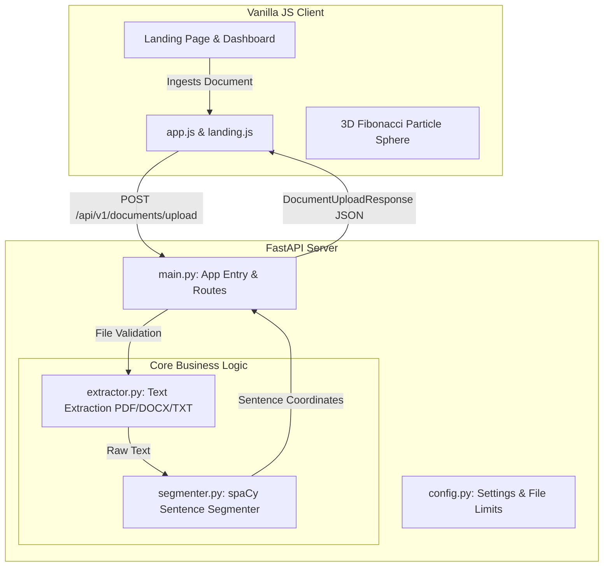
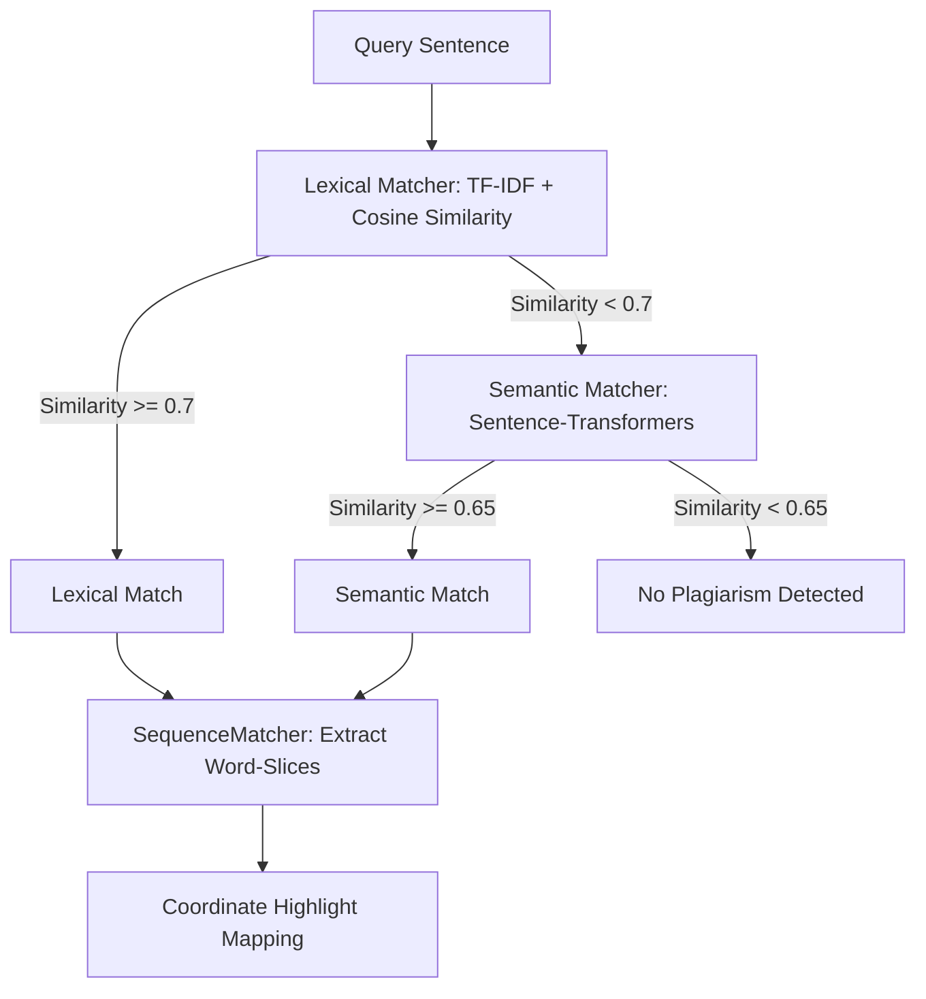

# Project Understanding: Lemma Plagiarism Analysis & Paraphrasing Platform

This document summarizes the system architecture of **Project Lemma** based on the codebase analysis and details the implementation plan for **Phase 2: Dual-Tier Matcher Engine**.

---

## 1. Current System Architecture (Phase 1 Complete)

The project currently implements a decoupled client-server architecture with:
1. A FastAPI backend serving the API and static frontend assets.
2. A vanilla HTML5/CSS3/JavaScript frontend featuring a Stark-themed landing page (with a 3D Fibonacci Particle Sphere) and a document dashboard.

### Component Map

### Active Codebase Implementation Details

*   **`backend/app/config.py`**:
    *   Enforces file upload constraints (Max size: `100MB`, extensions: `.pdf`, `.docx`, `.txt`).
    *   Ensures the target folder (`backend/uploads`) is dynamically created.
    *   Defines placeholders for `REDIS_URL`, `SQLITE_DB_FILE`, and `SPACY_MODEL` (`en_core_web_sm`).
*   **`backend/app/services/extractor.py`**:
    *   **TXT**: Decodes with UTF-8 fallback to Latin-1.
    *   **DOCX**: Uses `python-docx` to extract text from both paragraphs and table cells.
    *   **PDF**: Uses `pypdf` to extract text, decrypts password-free files, and raises `ExtractionError` for scanned or encrypted PDFs.
*   **`backend/app/services/segmenter.py`**:
    *   Uses a class-level singleton instance of the `en_core_web_sm` model from `spaCy`.
    *   Optimizes sentence segmentation by disabling the Named Entity Recognizer (`ner`) and the `lemmatizer`.
    *   Trims leading/trailing whitespaces while accurately recalculating the character offsets (`start_char`, `end_char`) relative to the original raw text.
*   **`backend/app/main.py`**:
    *   CORS configuration is fully open.
    *   Maps exceptions to appropriate HTTP status codes (`FileSizeExceededError` $\rightarrow$ `413`, `UnsupportedFileTypeError` $\rightarrow$ `400`, `ExtractionError` $\rightarrow$ `422`).
    *   Exposes endpoints `/health` (and `/api/v1/health`), and `/api/v1/documents/upload` which ingests files and returns structured sentences with coordinate offsets.
    *   Mounts the `frontend/` directory to serve static client assets.

---

## 2. Design Specification for Phase 2: Dual-Tier Matcher Engine 

Phase 2 transitions the system from simple ingestion to core plagiarism detection. We will implement both lexical (keyword overlap) and semantic (vector embeddings) matching models to capture verbatim copying and advanced paraphrasing.

### Proposed Architecture for the Matcher Engine

### Key Components to Implement

1.  **Mock Reference Dataset (`backend/app/data/mock_references.json`)**:
    *   Establish a local dataset of academic texts, papers, or articles.
    *   Each reference document will store its title, source details, full text, and a pre-segmented list of sentences.

2.  **Lexical Matcher (`backend/app/services/matcher.py` - `LexicalMatcher`)**:
    *   Uses `scikit-learn`'s `TfidfVectorizer` to convert all reference sentences into TF-IDF vectors.
    *   At startup/initialization, the vectorizer is fitted on the reference corpus, and reference vectors are cached.
    *   Computes cosine similarity between the query sentence vector and all reference vectors.
    *   Detects exact or near-verbatim plagiarism.

3.  **Semantic Matcher (`backend/app/services/matcher.py` - `SemanticMatcher`)**:
    *   Uses `sentence-transformers` with the `all-MiniLM-L6-v2` bi-encoder model to encode reference sentences into dense vector embeddings.
    *   Embeddings are computed and cached at initialization.
    *   Computes vector cosine similarity to capture paraphrased sentences where words differ but the underlying meaning remains similar.

4.  **Sequence Matcher (`backend/app/services/matcher.py` - `SequenceMatcher` helper)**:
    *   Uses `difflib.SequenceMatcher` to find matching word/character blocks between the query sentence and the matched reference sentence.
    *   Returns relative starting and ending coordinates of matching substrings, enabling targeted highlights.

5.  **Dual-Tier Matcher Coordinator (`backend/app/services/matcher.py` - `DualTierMatcher`)**:
    *   Coordinates the execution order: first checks `LexicalMatcher` (high confidence for copy-paste); if no match exceeds the threshold, checks `SemanticMatcher`.
    *   Returns a detailed analysis object with an overall plagiarism percentage, count of lexical/semantic matches, and sentence-by-sentence match details (including source document metadata and sequence coordinates).

---

## 3. Recommended Verification Plan for Phase 2

*   **Unit Tests (`backend/tests/test_matcher.py`)**:
    *   Test `LexicalMatcher` with exact sentence copies and slightly modified versions.
    *   Test `SemanticMatcher` with heavily paraphrased sentences (synonym replacement, active/passive voice shifts).
    *   Test the coordinate mapping logic to ensure character slices returned match original offsets.
*   **System Test Validation**:
    *   Run test scripts using the mock JSON reference dataset to verify pipeline execution speed and accuracy.
